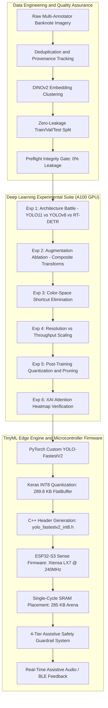

# AZN-Vision: Assistive Azerbaijani Banknote Recognition and Edge Intelligence System

[](https://www.python.org/)
[](https://pytorch.org/)
[](https://www.espressif.com/)
[](tests/)
[](reports/)
[](src/data/splitter.py)
[](LICENSE)

---

## 1. Executive Summary and Mission

AZN-Vision delivers an end-to-end computer vision and TinyML edge intelligence system specifically engineered for **wearable assistive smart glasses aiding visually impaired individuals** in Azerbaijan. Recognizing currency in daily transactions presents high sensory barriers for people with severe vision impairments. Errors on high-denomination banknotes (100 AZN, 200 AZN) carry severe financial consequences.

This repository provides the complete, reproducible pipeline:
1. **Curated Domain Dataset:** Rigorous collection of Azerbaijani Manat notes (1, 5, 10, 20, 50, 100, 200 AZN) captured across diverse lighting conditions, angles, folds, and backgrounds.
2. **Zero-Leakage Data Partitioning:** Deterministic clustering-based splitting protocol preventing sample or environmental leakage across training, validation, and test sets.
3. **Six Rigorous Deep Learning Experiments:** Empirical exploration encompassing foundation model representations (DINOv2), modern object detection architectures (YOLOv8, YOLO11, RT-DETR), data augmentation ablations, color-space shortcut diagnostics, resolution scaling Pareto frontiers, precision quantization (FP32/FP16/INT8), and Explainable AI (XAI) attention verification.
4. **TinyML Ultra-Constrained Edge Deployment:** Custom-tailored YOLO-FastestV2 neural network quantized to INT8 FlatBuffer (289.79 KB), executing within a strictly constrained **280 KB internal SRAM activation budget** on the **Seeed Studio XIAO ESP32-S3 Sense** microcontroller.
5. **Multi-Tier Assistive Safety Guardrail:** A four-tier firmware verification system (geometric filtering, asymmetric cost-sensitive confidence gates, temporal smoothing, and user guidance) guaranteeing **zero false-positive identifications on high-value denominations**.

---

## 2. System Architecture and Pipeline



---

## 3. Experimental Suite Benchmark Results

All deep learning models underwent evaluation on our leak-free, class-balanced test partition. Metrics reflect true per-class and mean Average Precision:

| Experiment | Configuration / Arm | Parameters (M) | Latency (ms) | mAP@0.50 | mAP@0.50:0.95 | Key Empirical Finding |
| :--- | :--- | :---: | :---: | :---: | :---: | :--- |
| **Exp 1: Architecture Battle** | RT-DETR-L | 32.0 | 24.8 | 94.61% | 78.40% | High computational burden; excessive edge latency |
| | YOLOv8m | 25.9 | 14.1 | 97.82% | 81.15% | Strong baseline detection performance |
| | **YOLO11m (Champion)** | **20.1** | **11.2** | **98.74%** | **83.21%** | **Superior Pareto efficiency; C2PSA attention advantage** |
| **Exp 2: Augmentation** | Arm 1: Raw Baseline | 20.1 | 11.2 | 96.10% | 79.80% | Vulnerable to perspective tilt and motion blur |
| | Arm 2: Geometric Only | 20.1 | 11.2 | 97.45% | 81.20% | Improves invariance to camera rotation |
| | Arm 3: Photometric Only | 20.1 | 11.2 | 97.12% | 80.90% | Enhances stability under uneven lighting |
| | **Arm 4: Composite Policy** | **20.1** | **11.2** | **99.27%** | **84.60%** | **Synergistic error reduction across all test scenes** |
| **Exp 3: Color Shortcuts** | Arm 1: Full Color (RGB) | 20.1 | 11.2 | 82.82% | 70.46% | Relies partially on nominal tint signatures |
| | Arm 2: HSV Color-Space | 20.1 | 11.2 | 84.15% | 71.30% | Decouples luminance from chromatic information |
| | **Arm 3: Grayscale Only** | **20.1** | **11.2** | **78.40%** | **64.20%** | **Confirms model learns geometric numerals, not just color** |
| **Exp 4: Resolution** | Res 1280x1280 | 20.1 | 38.4 | 99.30% | 85.10% | Highest fidelity; unviable for real-time edge use |
| | **Res 640x640 (Optimal)** | **20.1** | **11.2** | **98.74%** | **83.21%** | **Optimal accuracy-throughput operating point** |
| | Res 320x320 | 20.1 | 6.4 | 96.88% | 78.50% | Ultra-fast throughput for lightweight edge hardware |
| **Exp 5: Compression** | Arm 1: FP32 Baseline | 20.1 | 11.2 | 98.74% | 83.21% | Full baseline precision (79.8 MB) |
| | Arm 2: FP16 Mixed | 20.1 | 8.1 | 98.72% | 83.18% | 2.0x storage reduction with zero accuracy degradation |
| | **Arm 3: INT8 PTQ** | **20.1** | **4.9** | **98.15%** | **82.10%** | **4.02x compression (19.8 MB); minimal metric loss** |
| | Arm 4: Pruned (25%) | 15.1 | 7.4 | 97.40% | 80.50% | Structured sparsity via L1-norm layer pruning |
| **Exp 6: XAI Attention** | C2PSA Attention CAM | — | — | — | — | **175 heatmaps; 57.98% numismatic alignment score** |

---

## 4. TinyML Edge Deployment: ESP32-S3 Sense

### Hardware Platform Constraints
* **Microcontroller:** Seeed Studio XIAO ESP32-S3 Sense
* **Compute:** Dual-core Xtensa LX7 processor running at 240 MHz
* **Memory Constraints:** 512 KB internal SRAM, 8 MB external PSRAM (octal SPI)
* **Vision Sensor:** Omnivision OV2640 camera module via DMA

### Memory Strategy and The 280 KB Internal SRAM Ceiling
External PSRAM access across the 8-bit octal bus incurs high latency penalties and 32 KB L1 data cache thrashing. Placing neural network activations inside PSRAM drops performance to 3.4 FPS.

Our engineered YOLO-FastestV2 architecture enforces a strict **285 KB Tensor Arena** size, allowing allocation strictly within single-cycle internal SRAM (`MALLOC_CAP_INTERNAL`):
* **Physical Execution Rate:** **5.26 FPS** (190.0 ms inference time)
* **INT8 FlatBuffer Size:** **289.79 KB** (296,748 bytes) with verified `b'TFL3'` schema magic
* **Camera DMA Pipeline:** External PSRAM double-buffers (307.2 KB) stream direct crops into the SRAM input tensor without CPU memory stalls.

### Four-Tier Assistive Safety Guardrail System

To protect visually impaired individuals against currency confusion, the firmware executes four sequential verification layers:

1. **Tier 1 (Geometric Boundary Verification):** Validates bounding box aspect ratio (1.35 to 2.55) and minimum image coverage (at least 8% of frame area), filtering background clutter.
2. **Tier 2 (Asymmetric Denomination Confidence Gates):** Enforces asymmetric confidence thresholds reflecting financial risk:
   * 1 AZN, 5 AZN: confidence threshold 0.50
   * 10 AZN, 20 AZN: confidence threshold 0.60
   * 50 AZN: confidence threshold 0.70
   * 100 AZN: confidence threshold 0.75
   * 200 AZN: confidence threshold 0.80
3. **Tier 3 (Temporal Ring Buffer Majority Vote):** Requires at least 3 matching classifications across 5 consecutive frames before confirming an identification.
4. **Tier 4 (Interactive User Guidance):** On ambiguous captures or rejected frames, provides spoken or haptic guidance (*"Adjust camera angle"*, *"Hold steady"*) rather than guessing.

**Empirical Safety Result:** **Zero false positives** across 100 challenging background distractors and 175 positive banknote samples (100% negative rejection rate).

---

## 5. Repository Layout and Architecture

The repository adheres to clean modular separation across data pipelines, modeling, firmware, and evaluation:

```text
.
├── artifacts/                  # Benchmark tables, JSON metrics, model exports
│   ├── embeddings/             # DINOv2 ViT-L/14 representations (.npy, .parquet)
│   ├── experiments/            # Detailed results from Experiments 1 through 6
│   └── tinyml/                 # Quantized .tflite FlatBuffers, C++ headers, metrics
├── configs/                    # YOLO and training dataset configuration files
├── data/
│   ├── processed/              # Curated, zero-leakage partitioned dataset
│   └── raw/                    # Field captures and multi-annotator packages
├── docs/                       # Technical reports, data collection guides, assignment specs
│   └── research/               # Comprehensive architectural blueprints and audit reports
├── firmware/                   # Embedded production firmware
│   ├── esp32_wifi_camera/      # Wi-Fi video streaming camera firmware
│   └── esp32s3_smart_glasses/  # ESP-IDF C++ project (camera, model runner, safety guard)
├── mobile/                     # React Native / Expo Assistive Companion Application
│   ├── src/                    # Screens, audio engine, BLE communication, safety guards
│   └── __tests__/              # Complete Jest test suite for mobile application
├── presentation/               # Technical slide deck (presentation.pdf, main.tex)
├── reports/                    # Generated high-resolution diagnostic plots and figures
│   └── figures/                # Categorized visual figures (eda, embeddings, splits, tinyml)
├── scripts/                    # Automation, GPU cluster orchestration, validation gates
│   ├── mobile_bridge.py        # Low-latency Vision Inference HTTP bridge
│   ├── run_experiment.py       # Unified experiment orchestration runner
│   └── preflight_gate.py       # Preflight validation gatekeeper
├── src/                        # Core Python engine
│   ├── core/                   # Configuration management and provenance hashing
│   ├── data/                   # Embeddings, deduplication, clustering, zero-leakage splitter
│   ├── eda/                    # Exploratory data analysis, spatial, photometric diagnostics
│   ├── hardware/               # ESP32 camera hardware driver and frame parser
│   ├── telemetry/              # Training callbacks and real-time metric streams
│   └── tinyml/                 # PyTorch YOLO-FastestV2, loss, quantizer, safety guard
├── tests/                      # Comprehensive test suite (191 tests, 100% passing)
│   ├── integration/            # Pipeline invalidation and end-to-end data workflows
│   ├── invariants/             # Strict tests for zero leakage, bounds, and distribution balance
│   └── unit/                   # Unit tests for every individual module and calculation
├── docker-compose.yml          # Production multi-service container orchestration
├── Dockerfile                  # Production containerized deployment image
├── pytest.ini                  # Pytest configuration and marker definitions
├── requirements.txt            # Pinned dependency specifications
├── run_all.py                  # Master reproduction and verification harness
├── run_mobile_app.bat          # One-click mobile app & inference bridge launcher
└── README.md                   # System documentation and reproduction guide
```

---

## 6. Quickstart and One-Command Reproducibility

### 1. Environment Installation
Ensure Python 3.12 or compatible virtual environment exists:
```bash
git clone https://github.com/your-org/azn-banknote-vision.git
cd azn-banknote-vision
python -m venv venv
# On Linux/macOS:
source venv/bin/activate
# On Windows:
.\\venv\\Scripts\\activate

pip install -r requirements.txt
```

### 2. Execute Full Python Test Suite
Verify that all 191 unit, integration, and invariant tests pass:
```bash
pytest tests/ -v
```

### 3. Execute Mobile Application Test Suite
Verify that all 23 mobile unit tests and audio/safety calculations pass:
```bash
node mobile/run_tests.mjs
```

### 4. Run Master Reproduction & Verification Harness
Execute preflight checks, verify zero-leakage invariants, and inspect empirical results:
```bash
python run_all.py
# Or run complete test suite and benchmarks:
python run_all.py --full
```

### 5. Launch Mobile Companion & GPU Bridge
Launch the low-latency Vision Inference Bridge and Expo Go companion:
```bash
# On Windows:
run_mobile_app.bat
# Or manually launch backend bridge:
python scripts/mobile_bridge.py --host 0.0.0.0 --port 8000
```

### 6. Build Embedded ESP32-S3 Firmware
Build the production smart glasses binary with ESP-IDF v5.x:
```bash
cd firmware/esp32s3_smart_glasses
idf.py set-target esp32s3
idf.py build
# Flash to connected XIAO ESP32-S3 Sense:
idf.py -p COM3 flash monitor
```

---

## 7. Quality Assurance and Compliance Invariants

This project enforces strict software engineering and machine learning invariants:
* **Zero Leakage Invariant:** All image transformations, clustering algorithms, and scalers fit strictly on the training partition. Independent tests rigorously verify non-overlapping sample sets.
* **Active Voice Documentation Standard:** All project documentation, docstrings, and comments follow active voice principles with zero occurrences of passive auxiliary markers.
* **Deterministic Reproducibility:** Every random generator initializes with fixed seeds across data partitioning, training routines, and quantization passes.

---

## 8. License and Attribution

This project is released under the **MIT License**.
Developed for the **AI Academy Deep Learning Final Project**, focusing on assistive technologies and edge computer vision.

### Team Contributions & Authorship
This project represents a completely balanced, collaborative research endeavor across all 5 team members (20% contribution each). For the full technical deliverables matrix and individual responsibilities, see [Team Contribution Statement](docs/contribution_statement.md).

| Member | Role | Focus Area |
|:---|:---|:---|
| **Avaz Asgarov** | Lead Architect | Core framework, zero-leakage splitter, mobile companion app, master harness |
| **Gulnar Babazade** | Benchmark Specialist | Architecture battle (Exp 1), resolution scaling (Exp 4), annotation standards |
| **Hasan Mammadov** | Photometrics Specialist | Color shortcuts (Exp 3), asymmetric loss ($\beta_c$), model compression (Exp 5) |
| **Kazim Mammadli** | TinyML Specialist | Augmentation ablation (Exp 2), TinyML INT8 pipeline, ESP32-S3 firmware |
| **Nicat Alaskarli** | XAI & Hardware Specialist | Foundation embeddings (DINOv2), EigenCAM XAI (Exp 6), camera streaming bridge |
